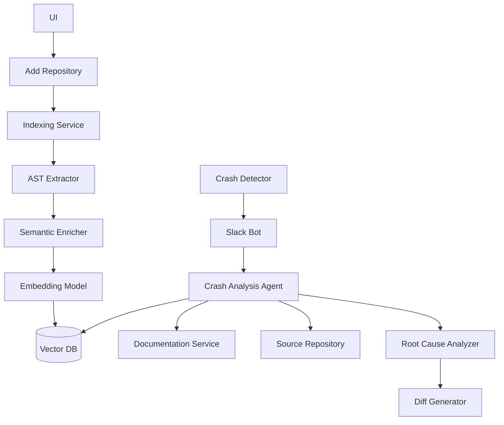

# CrashLens App — Backend

## Overview

CrashLens is an AI-powered crash analysis platform for modern SaaS and e-commerce applications. The backend provides RESTful APIs for crash simulation, repository management, RCA (Root Cause Analysis), GitHub integration, and real-time notifications.

## Tech Stack

- Python 3.11+
- FastAPI
- TIDB Vector Client
- LangChain

## High Level Design



## How to Run Locally

1. **Install dependencies:**
   ```sh
   cd crash-lens-app/backend
   poetry install
   ```

2. **Configure environment:**
   - Add Environment Variables to .env file in the backend dir
        ```
        VOYAGE_API_KEY=
        TIDB_CONNECTION_STRING=
        GITHUB_TOKEN=
        ```
   - Configure AWS keys in your system

3. **Start the API server:**
   ```sh
   uvicorn "main:app" --host 0.0.0.0 --port 8000
   ```
   - The API runs at `http://localhost:8000`.

## Key Features

- **Repository Management:** Add/remove GitHub repositories.
- **WebSocket Notifications:** Real-time updates to frontend.
- **Semantic Storage:** Embeddings for code snippets, error logs, and documentation are indexed and stored for fast retrieval.
- **Slack Notification** - Notifies crashes immedailtely in slack
- **Multimodal RAG:** Combines text code semantics and technical document images / pdfs, enabling the LLM agent to reason across multiple data types and sources.
- **Contextual RCA:** RCA agent uses indexed semantics/ documents to provide context-aware suggestions and fixes.

## API Endpoints

- `/api/v1/simulate-crash` — Simulate crash scenarios
- `/api/v1/repository` — Manage repositories
- `/api/v1/insights` — Crash analytics

See [src/app/api](src/app/api) for details.

## Design Highlights

- Modular FastAPI routers for each domain
- LLM-powered RCA agent (see [`error_analyzer_agent`](src/app/core/agents/error_analyzer_agent.py))
- WebSocket for instant frontend updates
